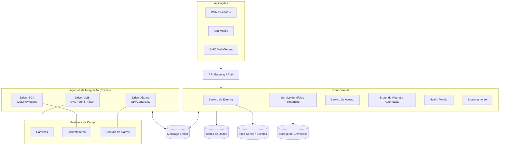
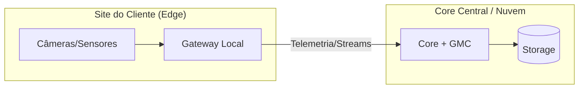
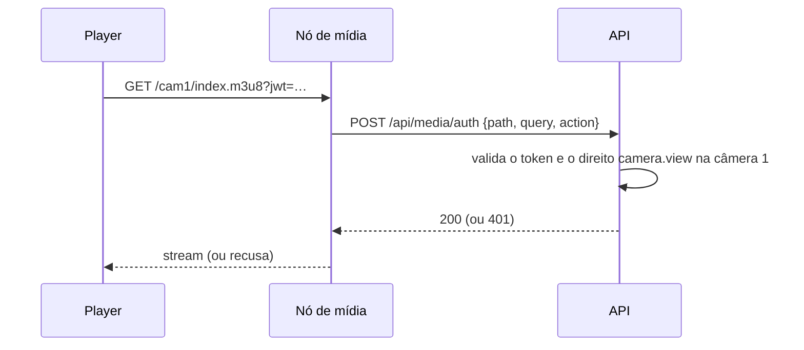

# 🛡️ Plataforma Unificada de Segurança Eletrônica

> Documentação Técnica de Arquitetura — VMS (CFTV) · Controle de Acesso (SCA) · Centrais de Alarme · IoT


---

## 📑 Índice

- [1. Visão Geral do Sistema](#1-visão-geral-do-sistema)
  - [1.1 Objetivo](#11-objetivo)
  - [1.2 Multimarcas (Agnóstico de Hardware)](#12-multimarcas-agnóstico-de-hardware)
  - [1.3 Compatibilidade de Protocolos](#13-compatibilidade-de-protocolos)
- [2. Arquitetura do Sistema e Escalabilidade](#2-arquitetura-do-sistema-e-escalabilidade)
  - [2.1 Microsserviços / Arquitetura Modular](#21-microsserviços--arquitetura-modular)
  - [2.2 Flexibilidade de Topologia (Deployment)](#22-flexibilidade-de-topologia-deployment)
  - [2.3 Redundância e Alta Disponibilidade](#23-redundância-e-alta-disponibilidade)
- [3. Módulos do Sistema](#3-módulos-do-sistema)
  - [3.1 Módulo de Vídeo (VMS)](#31-módulo-de-vídeo-vms)
  - [3.2 Módulo de Controle de Acesso (SCA)](#32-módulo-de-controle-de-acesso-sca)
  - [3.3 Módulo de Alarmes e Eventos](#33-módulo-de-alarmes-e-eventos)
  - [3.4 Módulo de Integração / Drivers](#34-módulo-de-integração--drivers)
- [4. Portais e Interfaces (Aplicações)](#4-portais-e-interfaces-aplicações)
  - [4.1 Painel do Cliente / Operacional](#41-painel-do-cliente--operacional)
  - [4.2 Painel Administrativo / Global Management Console (GMC)](#42-painel-administrativo--global-management-console-gmc)
- [5. Modelo de Licenciamento](#5-modelo-de-licenciamento)
  - [5.1 Licenciamento por Dispositivo](#51-licenciamento-por-dispositivo-pay-as-you-grow)
  - [5.2 Edições / Tiers](#52-edições--tiers)
  - [5.3 Add-ons](#53-add-ons)
- [6. Ideias Inovadoras para Agregar Valor Corporativo](#6-ideias-inovadoras-para-agregar-valor-corporativo)
- [7. Requisitos Não-Funcionais, Segurança e Conformidade](#7-requisitos-não-funcionais-segurança-e-conformidade)
- [8. Estratégia de Deploy e DevOps](#8-estratégia-de-deploy-e-devops)
- [9. Stack Tecnológica e Implementação de Referência](#9-stack-tecnológica-e-implementação-de-referência)
  - [9.1 Stack escolhida](#91-stack-escolhida)
  - [9.2 Como executar no Windows](#92-como-executar-no-windows)
  - [9.3 Como executar em nuvem / Docker](#93-como-executar-em-nuvem--docker)
  - [9.4 Estrutura do código](#94-estrutura-do-código)
  - [9.5 API do módulo VMS](#95-api-do-módulo-vms) · 📘 [referência](docs/MODULO-VMS.md) · 📗 [manual prático](docs/MANUAL-VMS-FUNCIONALIDADES.md)
  - [9.6 Decisões de implementação do VMS](#96-decisões-de-implementação-do-vms)
  - [9.7 Como escalar](#97-como-escalar)
  - [9.8 Como adicionar um fabricante](#98-como-adicionar-um-fabricante)
  - [9.9 Roadmap de implementação](#99-roadmap-de-implementação)
- [10. Módulo de Segurança e Controle de Acesso ao Sistema](#10-módulo-de-segurança-e-controle-de-acesso-ao-sistema)
  - [10.1 Modelo de identidade](#101-modelo-de-identidade)
  - [10.2 Direitos por objeto (allow/deny)](#102-direitos-por-objeto-allowdeny) · 📘 [guia de permissões e grupos](docs/PERMISSOES-E-GRUPOS.md)
  - [10.3 Controles de autenticação](#103-controles-de-autenticação)
  - [10.4 Auditoria](#104-auditoria)
  - [10.5 API de segurança](#105-api-de-segurança)
  - [10.6 Primeiro acesso](#106-primeiro-acesso)
  - [10.7 Hardening para produção](#107-hardening-para-produção)
  - [10.8 Testes executados](#108-testes-executados)
- [11. Drivers de Fabricante (protocolo nativo)](#11-drivers-de-fabricante-protocolo-nativo)
  - [11.1 Por que o protocolo nativo](#111-por-que-o-protocolo-nativo)
  - [11.2 Driver Hikvision (ISAPI)](#112-driver-hikvision-isapi)
  - [11.3 Eventos nativos](#113-eventos-nativos)
- [12. Painel Administrativo](#12-painel-administrativo)
  - [12.1 Árvore de navegação](#121-árvore-de-navegação)
  - [12.2 Cadastro de câmera](#122-cadastro-de-câmera)
  - [12.3 Configurações do Sistema](#123-configurações-do-sistema)
  - [12.4 API administrativa](#124-api-administrativa)
  - [12.5 O que ainda não executa](#125-o-que-ainda-não-executa)
- [13. Endurecimento e Prevenção de Vazamento](#13-endurecimento-e-prevenção-de-vazamento)
  - [13.1 Vazamentos encontrados e fechados](#131-vazamentos-encontrados-e-fechados)
  - [13.2 Autorização de streaming](#132-autorização-de-streaming)
  - [13.3 Demais controles](#133-demais-controles)
  - [13.4 Duas travas contra auto-bloqueio](#134-duas-travas-contra-auto-bloqueio)
  - [13.5 O que ainda não está coberto](#135-o-que-ainda-não-está-coberto)
- [Apêndice A — Glossário de Siglas e Protocolos](#apêndice-a--glossário-de-siglas-e-protocolos)
- [Apêndice B — Matriz de Compatibilidade de Fabricantes](#apêndice-b--matriz-de-compatibilidade-de-fabricantes)
- [Histórico de Revisões](#histórico-de-revisões)

---

## 1. Visão Geral do Sistema

### 1.1 Objetivo

Unificar **CFTV**, **Controle de Acesso** e **Alarmes** em uma plataforma única, escalável, **agnóstica de hardware** e com **alta disponibilidade**, substituindo a operação de múltiplos softwares proprietários isolados por um cockpit único de monitoramento e gestão.

**Dores de mercado que resolve:**
- Ilhas de software (um app por fabricante) sem correlação de eventos.
- Impossibilidade de gerir múltiplos sites/clientes de forma centralizada.
- Dependência (lock-in) de um único fabricante de hardware.
- Falta de automação entre subsistemas (alarme não "conversa" com o vídeo).

**Personas:**

| Persona | Necessidade principal |
|---------|-----------------------|
| Integrador / Instalador | Cadastrar hardware de qualquer marca rápido e sem retrabalho |
| Operador de Monitoramento (CFTV) | Tratar eventos, ver vídeo sob alarme, seguir o POP |
| Administrador de Segurança | Regras de acesso, relatórios, auditoria |
| Gestor de Central (Multi-Tenant) | Saúde da infraestrutura e licenças de vários clientes |
| Cliente Final / Síndico | App para abrir portas, ver câmeras, receber notificações |

**Casos de uso macro:** monitoramento 24/7 de condomínios e empresas; central de monitoramento terceirizada (Multi-Tenant); cidade segura / LPR; controle de acesso corporativo com anti-passback.

### 1.2 Multimarcas (Agnóstico de Hardware)

Suporte nativo e via *drivers* aos principais fabricantes do mercado. A [Camada de Drivers](#34-módulo-de-integração--drivers) abstrai o hardware: o core nunca fala com o dispositivo diretamente.

| Categoria | Fabricantes-alvo | Método de Integração |
|-----------|------------------|----------------------|
| CFTV / VMS | Intelbras, Hikvision, Dahua, Axis, Bosch | ONVIF (S/G/T) · RTSP · SDK nativo |
| Controle de Acesso | Control iD, Intelbras, HID, ZKTeco | SDK · OSDP · Wiegand · REST |
| Alarmes | JFL, Paradox, Intelbras, Bosch | SIA-DC09 · Contact ID |

> Matriz completa no [Apêndice B](#apêndice-b--matriz-de-compatibilidade-de-fabricantes).

### 1.3 Compatibilidade de Protocolos

| Domínio | Protocolos / Padrões | Uso |
|---------|----------------------|-----|
| Vídeo | ONVIF **Profile S** (streaming), **G** (gravação/edge), **T** (analytics avançado/H.265) | Descoberta, stream, PTZ, eventos |
| Vídeo | RTSP / RTP | Transporte de mídia ao vivo |
| Vídeo | SDKs nativos | Recursos proprietários fora do ONVIF |
| Acesso | OSDP (Secure Channel) | Comunicação leitora↔controladora criptografada |
| Acesso | Wiegand | Legado, leitoras antigas |
| Alarme | SIA-DC09 | Recepção IP de eventos de central |
| Alarme | Contact ID | Formato clássico de eventos (via receptora) |
| Integração | REST APIs | CRUD, comandos, configuração |
| Integração | WebSockets | Eventos e telemetria em tempo real (push) |
| Integração | MQTT | Telemetria IoT / borda (opcional) |

---

## 2. Arquitetura do Sistema e Escalabilidade

### 2.1 Microsserviços / Arquitetura Modular

Separação entre **serviços centrais (core)** e **agentes de integração de hardware**, comunicando-se por um **Message Broker** (assíncrono) e **API Gateway** (síncrono).



**Serviços (bounded contexts):**

| Serviço | Responsabilidade |
|---------|------------------|
| API Gateway / Auth | Roteamento, autenticação (JWT/OAuth2), RBAC |
| Serviço de Eventos | Ingestão, correlação e distribuição de eventos |
| Serviço de Mídia | Ingestão RTSP, transcodificação, gravação, playback |
| Serviço de Acesso | Regras, credenciais, comandos de porta |
| Motor de Regras | Automação IFTTT interna |
| Health Monitor | Coleta de saúde de servidores e dispositivos |
| Licenciamento | Validação e contagem de licenças |
| Agentes / Drivers | Tradução protocolo↔core por família de hardware |

**Comunicação:** REST/gRPC (síncrono, comandos) + Message Broker/WebSocket (assíncrono, eventos e streams de telemetria). **Persistência poliglota:** relacional (config/cadastro), time-series (eventos/telemetria), object storage (gravações).

### 2.2 Flexibilidade de Topologia (Deployment)

| Topologia | Descrição | Perfil |
|-----------|-----------|--------|
| **All-in-One** | Todos os módulos + banco em um único servidor | Pequeno/Médio porte |
| **Distribuído / Multi-Node** | Serviços separados por função em servidores dedicados | Alta volumetria |
| **Edge / Gateway Local** | Servidor local no cliente processa e envia telemetria/streams ao core | Multi-site / borda |



### 2.3 Redundância e Alta Disponibilidade

- **Failover:** modos **ativo/passivo** e **ativo/ativo** para servidores de gravação/processamento.
- **Buffer Offline / Edge Storage:** gravação na borda (cartão SD via ONVIF Profile G) com **sincronização automática** ao reconectar — sem perda de imagem durante quedas de link.
- **Balanceamento de carga** entre nós de mídia; **replicação** do banco (primário/réplica).
- **Metas de recuperação:**

| Métrica | Alvo de referência |
|---------|--------------------|
| RTO (tempo de recuperação) | ≤ 60 s (failover automático) |
| RPO (perda de dados) | ≈ 0 para eventos; janela de buffer p/ vídeo |
| Disponibilidade | 99,9% (Professional) / 99,99% (Enterprise) |

---

## 3. Módulos do Sistema

### 3.1 Módulo de Vídeo (VMS)

| Funcionalidade | Descrição |
|----------------|-----------|
| Live Streaming | Visualização ao vivo, multi-stream, PTZ, grids customizáveis |
| Gravação | Contínua, por evento e agendada; retenção configurável |
| Edge Recording | Failover de gravação no dispositivo (Profile G) |
| Analytics / IA | LPR/ALPR, detecção de movimento, reconhecimento facial, invasão de perímetro, objeto abandonado |
| Busca / Playback | Linha do tempo, busca por evento/metadado, exportação |
| Exportação | Vídeo assinado, com marca d'água e trilha de auditoria |

**IA:** processada na borda (câmera/gateway) ou no servidor (GPU), publicando metadados como eventos para o [Motor de Regras](#6-ideias-inovadoras-para-agregar-valor-corporativo).

### 3.2 Módulo de Controle de Acesso (SCA)

- **Gestão de pessoas e veículos:** cadastro, grupos, validade, visitantes.
- **Regras de acesso:** por horário, nível, feriado e zona.
- **Anti-passback:** bloqueio de reentrada sem saída registrada.
- **Eclusa / intertravamento:** porta B só abre com porta A fechada.
- **Credenciais múltiplas:** biometria, cartão (RFID/Mifare), QR Code, facial, PIN.
- **Comandos remotos:** abertura de porta/cancela pelo operador e pelo app.

### 3.3 Módulo de Alarmes e Eventos

- **Receptora de eventos:** ingestão via SIA-DC09 / Contact ID de múltiplas centrais.
- **Mapa sinóptico interativo:** ícones de zonas/sensores mudando de estado em tempo real.
- **Pop-up automático de vídeo:** disparo de alarme abre a câmera associada na tela do operador.
- **POP (Procedimento Operacional Padronizado):** roteiro passo a passo exibido ao operador durante o tratamento do evento, com registro de cada ação.
- **Fila de tratamento:** priorização, atribuição e status (aberto/em tratamento/resolvido).

### 3.4 Módulo de Integração / Drivers

Camada abstrata que traduz **SDK / API / Protocolo Padrão** para o modelo interno do core.

- **Contrato de driver (Driver SDK interno):** interface comum — `connect`, `discover`, `stream`, `command`, `subscribeEvents`.
- **Descoberta e provisionamento:** auto-descoberta ONVIF/WS-Discovery e cadastro assistido.
- **Ciclo de vida:** versionamento independente do core; hot-plug de novos drivers sem downtime.
- **Isolamento de falhas:** falha de um driver não derruba o core nem outros drivers.

---

## 4. Portais e Interfaces (Aplicações)

### 4.1 Painel do Cliente / Operacional

- Monitoramento em tempo real, grids de vídeo, busca de gravações, abertura de portas, tratamento de eventos e mapa sinóptico.
- **Web:** React/Vue (responsivo). **Mobile:** iOS/Android (notificações push, câmeras, abertura remota).
- **Perfis de acesso (RBAC):** o que cada operador vê e comanda é controlado por papel.

### 4.2 Painel Administrativo / Global Management Console (GMC)

- **Multi-Tenant / Centralizado:** gestão de múltiplos servidores de aplicação e múltiplos clientes/condomínios a partir de um painel master, com isolamento lógico de dados por tenant.
- **Health Monitor:** CPU, RAM, HD, temperatura, status dos streams e das controladoras em tempo real.
- **Gestão de licenças:** alocação, contagem e alertas de expiração.
- **Auditoria e logs:** trilha imutável de ações de usuários (quem fez o quê e quando).

---

## 5. Modelo de Licenciamento

### 5.1 Licenciamento por Dispositivo (Pay-as-you-grow)

| Unidade de Licença | Métrica |
|--------------------|---------|
| Canal de vídeo | Por câmera/stream |
| Ponto de acesso | Por porta / cancela |
| Central / Zona de alarme | Por central ou por zona |

### 5.2 Edições / Tiers

| Recurso | Express | Professional | Enterprise |
|---------|:-------:|:------------:|:----------:|
| Topologia | Standalone/local | Multisserviço | Multi-server distribuído |
| Failover (HA) | — | ✅ Ativo/Passivo | ✅ Ativo/Ativo |
| Multi-Tenant / GMC | — | — | ✅ |
| Edge / Gateway Local | — | Opcional | ✅ |
| Motor de Regras (IFTTT) | Básico | ✅ | ✅ Avançado |
| Suporte a Add-ons de IA | — | ✅ | ✅ |
| Perfil de projeto | Pequeno | Médio | Grande / Central de monitoramento |

### 5.3 Add-ons

- **Analytics de IA:** LPR/ALPR, reconhecimento facial, perímetro.
- **Módulos de integração específicos:** SDKs proprietários, sistemas de terceiros (ERP, interfonia).
- **Alta disponibilidade:** pacote de failover e replicação.

---

## 6. Ideias Inovadoras para Agregar Valor Corporativo

- **🗺️ Mapeamento Sinóptico 2D/3D interativo** — plantas baixas com localização dinâmica de câmeras e status de portas/sensores; clique no ícone abre o vídeo.
- **⚙️ Motor de Automação de Regras (IFTTT interno)** — regras encadeadas visuais.
  > Ex.: *"**SE** sensor X da central Y disparar → **ENTÃO** ligar relé Z + mover PTZ da câmera 02 para Preset 3 + notificar o App."*
- **🩺 Health Check Inteligente / Manutenção Preditiva** — alertas de degradação de HD (S.M.A.R.T.), perda de sinal de vídeo, queda de FPS e desconexão de controladoras antes da falha total.
- **🔐 Criptografia End-to-End e LGPD/GDPR Readiness** — anonimização de rostos (blur automático), exportação auditável com marca d'água e trilha de quem exportou.

---

## 7. Requisitos Não-Funcionais, Segurança e Conformidade

**Segurança (Cyber):**
- Criptografia em trânsito (TLS 1.2+) e em repouso (AES-256).
- Autenticação forte: OAuth2/JWT, MFA, sessão com expiração.
- **RBAC** granular por módulo e por tenant.
- Hardening: segregação de rede de câmeras (VLAN), princípio do menor privilégio, OSDP Secure Channel em vez de Wiegand.

**Conformidade LGPD / GDPR:**
- Base legal e finalidade para dados biométricos e faciais.
- Retenção e descarte automático de gravações; direito de eliminação.
- Anonimização (blur) e logs de acesso a dados pessoais.

**Desempenho e capacidade:** metas de streams simultâneos por nó, IOPS de gravação e latência de comando de porta (< 1 s).

**Observabilidade:** logs centralizados, métricas (Prometheus-like), tracing distribuído e auditoria imutável.

**SLA:** conforme edição (99,9% / 99,99%).

---

## 8. Estratégia de Deploy e DevOps

- **Containerização:** Docker; orquestração com Kubernetes (Enterprise) ou Docker Compose/Swarm (All-in-One).
- **CI/CD:** pipeline com build, testes automatizados, versionamento semântico e deploy azul/verde.
- **Modelos de entrega:** on-premise, nuvem ou híbrido (core na nuvem + gateways na borda).
- **Backup e Disaster Recovery:** snapshots de banco, replicação de storage e runbook de recuperação testado.
- **Atualização:** deploy sem downtime por serviço; drivers atualizáveis independentemente (hot-plug).

---

## 9. Stack Tecnológica e Implementação de Referência

### 9.1 Stack escolhida

| Camada | Tecnologia | Por quê |
|--------|-----------|---------|
| Core / API / Drivers | **C# / .NET 8** (Minimal API + EF Core) | Único ecossistema onde os SDKs de Intelbras, Hikvision, Dahua e Bosch são nativos; async maduro para milhares de streams; roda como Windows Service **e** em contêiner Linux |
| Nó de mídia (live) | **MediaMTX** (binário) | Converte RTSP → **WebRTC/HLS** pronto; reescrever isso custaria meses |
| Gravação | **FFmpeg** (`-c copy`, MP4 fragmentado) | Sem transcodificação: CPU ~0 por câmera; grava direto no disco |
| Banco | **SQLite** (Windows/dev) → **PostgreSQL** (nuvem) | Só muda a *connection string* |
| Event bus | In-memory (All-in-One) → Redis (Distribuído) | Troca por DI, sem alterar regra de negócio |
| Frontend | HTML+HLS.js (operacional) → React (produto) | Grid funcional desde o dia 1 |
| Deploy | Docker Compose / Kubernetes | Mesma imagem no Windows e na nuvem |

> **IA/Analytics (LPR, facial)** ficará em serviço **Python** isolado, consumido via API — única parte fora do .NET.

### 9.2 Como executar no Windows

**Pré-requisitos:**
1. [.NET 8 SDK](https://dotnet.microsoft.com/download/dotnet/8.0) — `winget install Microsoft.DotNet.SDK.8`
2. FFmpeg no PATH — `winget install Gyan.FFmpeg` ✅ *(já instalado nesta máquina)*
3. [MediaMTX](https://github.com/bluenviron/mediamtx/releases) — baixar `mediamtx.exe` para a raiz do projeto

```powershell
.\start-windows.ps1
```

Abra **http://localhost:8080** (painel) ou **/swagger** (API).

> Sem o `mediamtx.exe` a plataforma sobe assim mesmo: gravação e API funcionam, apenas o live no navegador fica indisponível.

### 9.3 Como executar em nuvem / Docker

```bash
docker compose up -d --build
```

Sobe 4 contêineres: `api`, `recorder` (gravação isolada), `media` (MediaMTX) e `db` (PostgreSQL). A mesma imagem roda em Azure Container Apps, AWS ECS ou Kubernetes.

### 9.4 Estrutura do código

```
SecurityPlatform.sln
├─ src/SecurityPlatform.Core/            # agnóstico: domínio + contratos
│  ├─ Domain/Models.cs                   # Tenant, Device, DeviceEvent, Recording
│  ├─ Data/PlatformDbContext.cs          # EF Core (SQLite ou PostgreSQL)
│  ├─ Drivers/IDeviceDriver.cs           # ⭐ contrato único de fabricante
│  ├─ Drivers/DriverRegistry.cs
│  ├─ Security/PermissionService.cs      # ⭐ resolução de direitos (allow/deny)
│  ├─ Security/AuditService.cs           # trilha de auditoria
│  └─ Events/EventBus.cs                 # in-memory ou Redis
├─ src/SecurityPlatform.Drivers.Onvif/   # driver ONVIF/RTSP (multimarca)
├─ src/SecurityPlatform.Modules.Vms/     # ⭐ MÓDULO VMS
│  ├─ MediaGateway.cs                    # publica RTSP como WebRTC/HLS
│  ├─ RecorderService.cs                 # FFmpeg por câmera + sharding
│  ├─ RetentionService.cs                # índice + descarte LGPD
│  └─ VmsEndpoints.cs                    # API do módulo
├─ src/SecurityPlatform.Modules.Security/# ⭐ MÓDULO DE SEGURANÇA
│  ├─ AuthService.cs                     # login, 2FA, bloqueio, faixa de IP
│  ├─ PasswordHasher.cs                  # PBKDF2 + política de senha
│  └─ SecurityEndpoints.cs               # auth, usuários, grupos, direitos
└─ src/SecurityPlatform.Api/             # host + painel web + WebSocket
```

**Regra de ouro:** o Core nunca fala com hardware. Tudo passa por `IDeviceDriver`.

### 9.5 API do módulo VMS

> 📘 **Referência completa:** [`docs/MODULO-VMS.md`](docs/MODULO-VMS.md) —
> modos de gravação, retenção, configuração e pendências.

| Método | Rota | Função |
|--------|------|--------|
| `GET` | `/api/vms/cameras` | Lista câmeras |
| `POST` | `/api/vms/cameras` | Cadastra, testa conexão e publica no nó de mídia |
| `DELETE` | `/api/vms/cameras/{id}` | Remove câmera, gravações e arquivos (`?keepFiles=true` preserva) |
| `GET` | `/api/vms/cameras/{id}/stream` | Retorna URLs `hls` e `webrtc` |
| `GET` | `/api/vms/cameras/{id}/snapshot` | JPEG — nativo, ou quadro do RTSP |
| `POST` | `/api/vms/cameras/{id}/ptz/move` · `/ptz/stop` | PTZ contínuo (velocidade em -1..1) |
| `GET`/`PUT` | `/api/vms/cameras/{id}/ptz/presets[/{preset}]` | Listar e gravar presets |
| `GET` | `/api/vms/cameras/{id}/recordings` | Playback paginado (`from`/`to`/`page`) |
| `GET` | `/api/vms/cameras/{id}/timeline` | Blocos contínuos, buracos e bookmarks |
| `POST` | `/api/vms/cameras/{id}/export` | Recorta um intervalo em um MP4 único |
| `GET` | `/api/vms/recordings/{id}/file` | Baixa/reproduz com seek (HTTP Range) |
| `GET`/`POST` | `/api/vms/cameras/{id}/bookmarks` | Marca incidente e protege da retenção |
| `POST`/`GET` | `/api/vms/events` | Ingestão e consulta de eventos |
| `POST` | `/api/vms/events/{id}/ack` | Trata o evento |
| `WS` | `/ws/events` | Eventos em tempo real para o operador |
| `GET` | `/api/drivers` · `/health` · `/swagger` | Infra |

**Exemplo — cadastrar câmera:**

```bash
curl -X POST http://localhost:8080/api/vms/cameras \
  -H "Content-Type: application/json" \
  -d '{"name":"Intelbras Portaria","host":"192.168.1.108","username":"admin","password":"senha"}'
```

### 9.6 Decisões de implementação do VMS

Pontos que separam um protótipo de um gravador confiável:

| Decisão | Por quê |
|---------|---------|
| **MP4 fragmentado** (`frag_keyframe+empty_moov`) | Sem fragmentação, o FFmpeg só escreve o arquivo ao fechar o segmento — uma queda de energia perderia os 10 minutos inteiros. Fragmentado, o disco recebe dados continuamente e **o arquivo já é reproduzível enquanto grava**. |
| **stderr do FFmpeg drenado** | Pipe redirecionado e não lido enche o buffer e **trava o processo** com a gravação pela metade. O gravador lê e registra tudo em log. |
| **Reconciliação do nó de mídia** | API e MediaMTX têm ciclos de vida independentes. Um serviço sincroniza os *paths* com o banco a cada 30s e remove órfãos — sem isso, uma câmera excluída deixaria um path apontando para endereço morto e o player receberia `HTTP 500`. |
| **`sourceOnDemand`** | O nó de mídia só puxa RTSP da câmera quando alguém assiste. Economia real de banda em instalações grandes. |
| **`paths: {}` no MediaMTX** | Nenhum publicador anônimo é aceito: só entram os *paths* que a API registra. |
| **"SEM SINAL" no player** | Câmera fora do ar é operação normal. O player informa e **tenta novamente a cada 15s** em vez de mostrar um quadro preto sem explicação. |
| **Auto-restart do gravador** | O gravador reconcilia a cada 15s e reergue qualquer FFmpeg que tenha caído. |
| **Enums como texto no JSON** | `"Online"` em vez de `1`: o contrato não quebra se a ordem dos membros mudar. |

### 9.7 Como escalar

| Necessidade | Ação |
|-------------|------|
| Mais câmeras gravando | Replicar `recorder` com `Vms__ShardCount=N` e `ShardIndex=0..N-1` — cada nó grava `Id % N` |
| Mais operadores assistindo | Adicionar nós MediaMTX (`Vms__MediaPublicHost` por nó) |
| Mais requisições na API | Replicar `api` (é *stateless*) atrás de load balancer |
| Multi-servidor / Multi-Tenant | Trocar `InMemoryEventBus` por Redis e SQLite por PostgreSQL |

Nenhuma dessas mudanças exige alterar código de negócio — só configuração.

### 9.8 Como adicionar um fabricante

```csharp
public class HikvisionSdkDriver : IDeviceDriver
{
    public string Name => "hikvision";
    public DeviceKind[] Supports => [DeviceKind.Camera];
    // ConnectAsync, GetStreamUrlAsync, CommandAsync, StreamEventsAsync
}
```

E registrar em `Program.cs`:
```csharp
builder.Services.AddSingleton<IDeviceDriver, HikvisionSdkDriver>();
```

Nada mais no sistema muda. É isso que torna a plataforma agnóstica.

### 9.9 Roadmap de implementação

| Fase | Escopo | Status |
|------|--------|:------:|
| 1 | Core, contrato de driver, event bus | ✅ |
| 2 | **VMS**: driver ONVIF, live WebRTC/HLS, gravação, retenção, playback | ✅ |
| 3 | **Segurança**: JWT, usuários, grupos, direitos allow/deny, 2FA, auditoria | ✅ |
| 4 | **Driver nativo Hikvision (ISAPI)**: PTZ, snapshot, device info, eventos alertStream | ✅ |
| 5 | **Painel administrativo**: status, câmeras, grupos, perfis, agenda, licença, automação | ✅ |
| 6 | Executar as regras de automação e aplicar agendamento/perfis na gravação | ✅ |
| 7 | Multi-tenant + integração LDAP/Active Directory | ⬜ |
| 8 | Módulo Controle de Acesso (OSDP/SDK) | ⬜ |
| 9 | Módulo Alarmes (SIA-DC09/Contact ID) + mapa sinóptico | ⬜ parcial (mapa ✅) |
| 10 | Mapa sinóptico 2D/3D e layouts de tela | ✅ mapa · layouts ⬜ |
| 11 | GMC Multi-Tenant | ⬜ |
| 12 | Analytics IA (serviço Python): LPR, facial | ⬜ |

---

## 10. Módulo de Segurança e Controle de Acesso ao Sistema

> Toda a API exige autenticação. Nenhum endpoint funcional responde sem token válido.

### 10.1 Modelo de identidade

| Entidade | Papel |
|----------|-------|
| **Usuário** | Credencial individual; pode ser administrador ou operador comum |
| **Grupo** | Conjunto de usuários que compartilham direitos (ex.: "Operadores") |
| **Direito (ObjectRight)** | Permissão sobre um objeto, concedida a usuário **ou** grupo |
| **Log de auditoria** | Registro imutável de quem fez o quê, quando e de qual IP |

Um usuário acumula os direitos próprios **mais** os de todos os seus grupos.

### 10.2 Direitos por objeto (allow/deny)

> 📘 **Guia completo:** [`docs/PERMISSOES-E-GRUPOS.md`](docs/PERMISSOES-E-GRUPOS.md) —
> perfis, herança de grupo, receitas de configuração e referência de API.

O modelo separa duas perguntas que antes estavam misturadas:

| Pergunta | Responde | Onde |
|----------|----------|------|
| **O que** pode fazer? | Perfil (`Role`) | `/api/roles` |
| **Sobre quais** câmeras? | Direito (`ObjectRight`) | `/api/groups/{id}/access` |

Quatro perfis vêm de fábrica — **Visualizador**, **Operador**, **Supervisor** e
**Administrador** — e não podem ser editados (duplique para personalizar).
Criar um grupo é escolher um perfil e marcar os grupos de câmera; antes exigia
marcar cada permissão sobre cada câmera.

Um direito pode apontar para **uma câmera** (`objectType: "camera"`) ou para um
**grupo de câmera** (`objectType: "cameragroup"`, incluindo os subgrupos). A
expansão acontece na leitura: câmera adicionada ao grupo depois **já nasce com o
acesso**, sem reconfigurar nada.

```http
PUT /api/groups/5/access
{
  "roleId": 2,                 // Operador
  "cameraGroupIds": [1],       // grupo "Prédio" (e subgrupos)
  "deniedCameraIds": [17],     // exceto o cofre
  "userIds": [3, 8, 12]
}
```

`POST /api/groups/preview` mostra o resultado **antes** de salvar, e
`GET /api/rights/effective/{userId}` diz **de onde veio** cada direito — não
apenas se ele existe.

Permissões disponíveis:

| Permissão | O que libera |
|-----------|--------------|
| `camera.view` | Ver ao vivo |
| `camera.playback` | Reproduzir gravações |
| `camera.export` | Exportar vídeo |
| `camera.ptz` | Controlar PTZ |
| `camera.config` | Cadastrar/editar/remover câmeras |
| `event.ack` | Tratar eventos |
| `user.manage` | Gerir usuários e grupos |
| `system.config` | Configuração do servidor |
| `audit.view` | Consultar auditoria |

**Regras de resolução:**
1. Administrador ignora a checagem e vê tudo.
2. Usuário inativo não tem acesso a nada.
3. `ObjectId` nulo = vale para **todos** os objetos daquele tipo.
4. **Deny sempre vence Allow.**
5. Direito sobre `cameragroup` desce para os subgrupos.
6. Direitos de outro `TenantId` nunca são considerados.

Isso permite o padrão mais usado na operação: *conceder amplo ao grupo e negar pontualmente*.

```jsonc
// Grupo "Operadores" vê todas as câmeras...
{ "subjectType": "Group", "subjectId": 1, "objectId": null,
  "permission": "camera.view", "effect": "Allow" }

// ...mas o usuário 2 não vê a câmera 2 (Deny vence)
{ "subjectType": "User", "subjectId": 2, "objectId": 2,
  "permission": "camera.view", "effect": "Deny" }
```

A filtragem é aplicada na consulta: a câmera negada **não aparece na listagem**, e o acesso direto à URL retorna `403`.

### 10.3 Controles de autenticação

| Controle | Implementação |
|----------|---------------|
| Hash de senha | PBKDF2-HMAC-SHA256, 210.000 iterações, salt por usuário (OWASP 2023) |
| Comparação | Tempo constante (`FixedTimeEquals`) — sem timing attack |
| Token | JWT HS256 com expiração configurável (padrão 60 min) |
| Política de senha | Mínimo configurável + maiúscula, minúscula, número e especial |
| Troca obrigatória | Senha inicial e reset exigem troca no primeiro acesso |
| Expiração de senha | Opcional, em dias (`PasswordExpiryDays`) |
| Bloqueio | N tentativas → bloqueio temporizado (padrão 5 / 15 min) |
| Enumeração de usuário | Mensagem genérica: não revela se o usuário existe |
| **2FA (TOTP)** | Compatível com Google Authenticator / Authy, janela ±1 passo |
| Faixa de IP | Allowlist por usuário, aceita IP exato e CIDR |
| WebSocket | Token por querystring apenas nas rotas `/ws` |
| Cabeçalhos | `X-Content-Type-Options`, `X-Frame-Options`, `Referrer-Policy` |
| Credencial da câmera | O RTSP com usuário/senha **nunca** é enviado ao navegador |
| Path traversal | Download de gravação confinado à raiz de storage |

### 10.4 Auditoria

Toda ação sensível gera registro: login (sucesso e falha), troca e reset de senha, criação/remoção de usuário, concessão de direito, cadastro/remoção de câmera, comandos de PTZ e reprodução de gravação.

Campos: usuário, ação, tipo e id do objeto, sucesso, detalhe, **IP de origem** e timestamp UTC.

### 10.5 API de segurança

| Método | Rota | Função |
|--------|------|--------|
| `POST` | `/api/auth/login` | Autentica (usuário, senha, 2FA opcional) |
| `GET` | `/api/auth/me` | Perfil + câmeras visíveis ao usuário |
| `POST` | `/api/auth/change-password` | Troca a própria senha |
| `POST` | `/api/auth/2fa/setup` | Gera segredo TOTP + URI para o app |
| `POST` | `/api/auth/2fa/confirm` | Ativa o 2FA após validar o código |
| `GET/POST/DELETE` | `/api/users` | Gestão de usuários *(admin)* |
| `POST` | `/api/users/{id}/reset-password` | Gera senha temporária *(admin)* |
| `POST` | `/api/users/{id}/active/{bool}` | Ativa/desativa usuário *(admin)* |
| `GET/POST` | `/api/groups` | Gestão de grupos *(admin)* |
| `POST/DELETE` | `/api/groups/{g}/members/{u}` | Vincula/desvincula usuário *(admin)* |
| `GET/POST/DELETE` | `/api/rights` | Concede e revoga direitos *(admin)* |
| `GET` | `/api/rights/permissions` | Lista as permissões do sistema |
| `GET` | `/api/rights/effective/{userId}` | **Consulta de direitos efetivos** — depuração |
| `GET` | `/api/audit` | Trilha de auditoria *(admin)* |

### 10.6 Primeiro acesso

No primeiro boot o sistema cria o usuário `admin` e o grupo `Operadores` (ver + playback + tratar eventos em todas as câmeras).

A senha é gerada aleatoriamente e **exibida uma única vez no log do servidor**, com troca obrigatória:

```
=================================================================
 Usuario inicial: admin
 Senha temporaria: 9ENpHQAYi%uQyaFu
 Troca obrigatoria no primeiro acesso.
=================================================================
```

Para definir a senha inicial, use `Security:BootstrapAdminPassword` no `appsettings.json`.

### 10.7 Hardening para produção

> ⚠️ **Obrigatório antes de expor o sistema:**

1. **Trocar `Security:JwtKey`** por uma chave aleatória de 32+ caracteres. A chave do `appsettings.json` é apenas de desenvolvimento.
2. Servir tudo sobre **HTTPS** (proxy reverso com TLS).
3. Restringir `AllowedIpRanges` das contas administrativas.
4. Ativar **2FA** para todo usuário administrador.
5. Guardar segredos em variáveis de ambiente ou cofre, nunca no repositório.

### 10.8 Testes executados

Validado em execução real nesta base de código:

| Cenário | Resultado |
|---------|:---------:|
| Endpoint funcional sem token | `401` |
| Senha incorreta → mensagem genérica | ✅ |
| Política de senha rejeita senha fraca | ✅ |
| Troca obrigatória no primeiro acesso | ✅ |
| Operador só enxerga as câmeras permitidas | ✅ |
| Deny em câmera específica vence o Allow do grupo | `403` |
| Operador tentando cadastrar câmera | `403` |
| Operador tentando listar usuários | `403` |
| Bloqueio após 5 tentativas (senha correta na 6ª é recusada) | ✅ |
| 2FA: setup, código inválido recusado, código válido aceito | ✅ |
| Login sem 2FA quando ativo | recusado |
| Auditoria registra falhas e sucessos com IP | ✅ |

#### Suíte automatizada

```bash
dotnet test tests/SecurityPlatform.Tests     # 27 testes
```

| Arquivo | Cobre |
|---------|-------|
| `PermissionServiceTests.cs` | herança de grupo, Deny sobre Allow, troca de perfil, tenant, ciclo na árvore, origem do direito, prévia × efetivo |
| `DatabaseBootstrapperTests.cs` | banco novo criado pela migration; banco legado do `EnsureCreated` adotado como baseline sem recriar o schema; idempotência do boot |
| `RetentionParsingTests.cs` | leitura do instante no nome do segmento, confinamento de caminho, sharding |

Validado também em execução real contra uma cópia do banco de produção: um banco
legado criado por `EnsureCreated` (sem `__EFMigrationsHistory`) foi adotado como
baseline na `InitialCreate`, sem recriar tabelas, e a aplicação subiu sem erro;
em seguida, um teste ponta a ponta exercitou perfis, prévia, configuração de
grupo, herança de câmera nova, troca de perfil e cascata.

---

## 11. Drivers de Fabricante (protocolo nativo)

### 11.1 Por que o protocolo nativo

ONVIF é o denominador comum — funciona em quase tudo, mas expõe o mínimo. **A regra do projeto é usar sempre o protocolo do fabricante quando existir**, e cair no ONVIF só como genérico.

| Recurso | ONVIF Profile S | Protocolo nativo |
|---------|:---------------:|:----------------:|
| Live e gravação | ✅ | ✅ |
| Modelo, firmware, nº de série | parcial | ✅ |
| Nº real de canais | parcial | ✅ |
| PTZ com presets nomeados | limitado | ✅ |
| Snapshot direto | renegocia mídia | ✅ |
| **Eventos de analítico da câmera** | ❌ | ✅ |
| Reinício remoto | ❌ | ✅ |

O item decisivo é o penúltimo: a analítica embarcada (cruzamento de linha, intrusão, face, placa) **só chega pelo protocolo do fabricante**.

### 11.2 Driver Hikvision (ISAPI)

Arquivos: [`HikvisionDriver.cs`](src/SecurityPlatform.Drivers.Hikvision/HikvisionDriver.cs) (nativo) · [`OnvifDriver.cs`](src/SecurityPlatform.Drivers.Onvif/OnvifDriver.cs) (genérico, fallback).

| Comando | Endpoint ISAPI |
|---------|----------------|
| `device_info` | `GET /ISAPI/System/deviceInfo` |
| `snapshot` | `GET /ISAPI/Streaming/channels/{ch}01/picture` |
| `ptz_preset` | `PUT /ISAPI/PTZCtrl/channels/{ch}/presets/{id}/goto` |
| `ptz_move` | `PUT /ISAPI/PTZCtrl/channels/{ch}/continuous` |
| `ptz_stop` | idem, com pan/tilt/zoom em 0 |
| `ptz_save_preset` | `PUT /ISAPI/PTZCtrl/channels/{ch}/presets/{id}` |
| `reboot` | `PUT /ISAPI/System/reboot` |
| Stream | `rtsp://host:554/Streaming/Channels/101` |

**Detalhes de implementação:**
- **Digest auth** via `SocketsHttpHandler` com `NetworkCredential` — negocia Digest ou Basic automaticamente.
- **Clientes HTTP cacheados** por dispositivo+credencial: criar um `HttpClient` por requisição esgotaria as portas TCP em instalações grandes.
- Canal ISAPI segue `{canal}0{stream}` — `101` = canal 1 principal, `102` = substream.

### 11.3 Eventos nativos

O driver mantém uma conexão longa em `GET /ISAPI/Event/notification/alertStream` — a câmera **empurra** os eventos, sem polling. O [`DeviceEventListener`](src/SecurityPlatform.Modules.Vms/DeviceEventListener.cs) consome, grava no banco e publica no barramento (WebSocket do operador).

| Evento ISAPI | Tipo na plataforma | Severidade |
|--------------|--------------------|:----------:|
| `VMD` | `motion` | 2 |
| `linedetection` | `line_crossing` | 2 |
| `fielddetection` | `intrusion` | 3 |
| `regionEntrance` / `regionExiting` | `region_entrance` / `region_exit` | 2 |
| `tamperdetection` / `shelteralarm` | `tamper` | 3 |
| `videoloss` | `video_loss` | 3 |
| `facedetection` | `face_detected` | 2 |
| `ANPR` | `lpr_detected` | 2 |
| `IO` | `io_trigger` | 2 |

Reconexão automática a cada 15s se a câmera cair. Eventos com `eventState=inactive` são descartados (o `videoloss` repete continuamente).

**Adicionar outro fabricante:** implemente `IDeviceDriver` e registre uma linha em [`Program.cs`](src/SecurityPlatform.Api/Program.cs). Nada no core muda.

---

## 12. Painel Administrativo

Aplicação separada em **`/admin.html`**, restrita a administradores. A navegação é uma **árvore por domínio**, no mesmo recorte de um cliente de administração profissional de VMS: cada área do sistema tem seu próprio ramo, e o cadastro de câmera é uma tela dedicada.

### 12.1 Árvore de navegação

```
Servidor de Gravação
├─ Câmeras                    ← cadastro dedicado (janela com abas)
├─ Status do servidor
├─ Uso de disco
└─ Log de atividade

Dispositivos de I/O           (não implementado)

Alertas e Eventos
├─ Eventos
├─ Eventos globais (regras)
└─ Contatos

Gerenciamento de Usuários
├─ Usuários
├─ Grupos
├─ Direitos
└─ Políticas de segurança

Análise e Mapas               (não implementado)

Configurações do Sistema
├─ Sistema                    ← geral, gravações, disco, SMTP, logs
├─ Filtros de IP
└─ Servidores de mídia        ← nó de mídia e perfis

Sistema
├─ Licenciamento
├─ Auditoria
└─ Informações do servidor
```

### 12.2 Cadastro de câmera

Menu próprio, com a lista de câmeras e uma **janela de configuração em abas** — o mesmo recorte do cadastro de um VMS profissional:

| Aba | Conteúdo |
|-----|----------|
| **Geral** | Nome, driver (protocolo), IP, porta, usuário e senha |
| **Streaming** | RTSP manual opcional (vazio = o driver monta pelo padrão do fabricante) |
| **Gravação** | Modo, retenção e atalho para a janela de **agendamento** |
| **PTZ** | Ir para preset, salvar posição, movimento contínuo e parada |
| **Grupos** | Grupos da câmera e atalho para a janela de grupos |
| **Equipamento** | Consulta ISAPI (modelo/firmware/série), snapshot e reinício |

Detalhes de usabilidade: o botão **Testar conexão** valida antes de salvar (com o RTSP mascarado), e **senha em branco mantém a atual** na edição.

**Grupos de câmeras** abrem em **janela sobre a mesma página** — criar grupo, vincular e desvincular câmeras sem sair da tela de cadastro.

### 12.3 Configurações do Sistema

Aba própria para o cadastro do sistema, persistido em banco:

| Bloco | Campos |
|-------|--------|
| Geral | Nome do servidor, descrição, fuso horário, idioma |
| Gravações | Diretório raiz, retenção padrão, duração do segmento, criptografia, marca d'água |
| Limites de disco | Percentual de alerta e percentual crítico |
| SMTP | Servidor, porta, TLS, usuário, senha (nunca devolvida), remetente |
| Retenção de logs | Sistema, eventos e auditoria, em dias |
| Filtros de IP | Allow/Deny por IP exato ou CIDR |

### 12.4 API administrativa

Prefixo `/api/admin`, todas as rotas exigindo perfil administrador.

| Método | Rota | Função |
|--------|------|--------|
| `GET` | `/server/health` · `/server/status` | Saúde e visão consolidada |
| `GET` | `/server/activity` | Log de atividade filtrável |
| `GET` | `/storage/usage` | Consumo de disco por câmera |
| `GET` · `PUT` | `/cameras/{id}` | Detalhe e edição |
| `POST` | `/cameras/test` | Testa conexão sem salvar |
| `GET` | `/cameras/{id}/device-info` | Identificação via protocolo nativo |
| `GET` · `POST` · `DELETE` | `/camera-groups` | Grupos de câmeras |
| `GET` · `POST` · `DELETE` | `/media-profiles` | Perfis de mídia |
| `GET` | `/media-profiles/{id}/storage-estimate` | Projeção de disco |
| `GET` · `POST` · `DELETE` | `/schedules` | Agendamento de gravação |
| `GET` · `PUT` | `/settings` | Configurações do sistema |
| `GET` · `POST` · `DELETE` | `/ip-filters` | Filtros de IP |
| `GET` · `POST` | `/license` | Licença e consumo |
| `GET` · `POST` · `DELETE` | `/contacts` · `/automation` | Contatos e regras |

### 12.5 O que ainda não executa

> Lista viva: **[`pendente.md`](pendente.md)** na raiz do repositório.

Transparência sobre o estado real da implementação:

| Item | Situação |
|------|----------|
| Regras de automação | ✅ Motor executa Email, PTZ preset, Bookmark, HttpRequest |
| Agendamento de gravação | ✅ `RecorderService` consulta `ScheduleSlot` |
| Perfis de mídia | ✅ Canal aplicado via `RecordingProfileId` / `LiveProfileId` |
| Contatos e SMTP | ✅ Envio na ação `Email` da automação (SMTP nas configurações) |
| Filtros de IP do servidor | Aplicados no pipeline |
| Criptografia de gravação | Campo salvo — **ainda não implementada** |
| Watermark na exportação | ✅ Aplicado quando `WatermarkExport` está ligado |
| Licenciamento | ✅ Bloqueia cadastro além dos canais (HTTP 409) |
| PTZ no driver ONVIF | Só o driver nativo Hikvision tem PTZ; ONVIF exige o serviço SOAP PTZ |
| Saúde por câmera | ✅ `GET /api/vms/cameras/health` + evento `recording_stalled` |
| Mapas, analítico, LPR, layouts, I/O, SCA, Alarmes | Não implementados |

Detalhes: [`pendente.md`](pendente.md) · [`docs/MODULO-VMS.md`](docs/MODULO-VMS.md#7-o-que-ainda-não-está-implementado).


---

## 13. Endurecimento e Prevenção de Vazamento

Auditoria de exposição feita sobre a instalação em execução. Cada item abaixo foi **encontrado como falha real** e corrigido.

### 13.1 Vazamentos encontrados e fechados

| # | Vazamento | Impacto | Correção |
|---|-----------|---------|----------|
| 1 | **Credenciais das câmeras em texto claro no banco** | Um dump do `.db` entregava usuário e senha de todos os equipamentos | Cifradas com Data Protection (AES-256 + HMAC), chave fora do banco |
| 2 | **Senha da câmera no log do servidor** | O FFmpeg repete a URL RTSP nas mensagens de erro; o log guardava `rtsp://admin:senha@…` | [`UrlMasking`](src/SecurityPlatform.Core/Drivers/UrlMasking.cs) mascara antes de qualquer saída |
| 3 | **API de controle do nó de mídia aberta na rede** | `GET :9997/v3/config/paths/list` devolvia as URLs RTSP **com as credenciais** de todas as câmeras — anulava o item 1 | `apiAddress: 127.0.0.1:9997` |
| 4 | **Streaming sem autenticação** | Quem alcançava `:8888` / `:8889` / `:8554` assistia qualquer câmera sem login; os direitos valiam só no painel | Autorização delegada ao backend por requisição de stream |
| 5 | **Swagger público** | Expunha toda a superfície da API a anônimos | Desabilitado por padrão; só sobe com `Security:EnableSwagger` |
| 6 | **`Server: Kestrel`** | Fingerprinting da stack | Removido |
| 7 | **Senha em querystring** | Erro de JS fazia o formulário cair em submit GET, levando a senha para URL, histórico e referrer | `method="post"` em todos os formulários de login |
| 8 | **MoQ escutando sem uso** | Porta aberta sem propósito | `moq: no` |

### 13.2 Autorização de streaming

O ganho estrutural desta rodada. O nó de mídia passou a **perguntar ao backend** antes de liberar cada leitura:



Com isso, o **Deny por câmera vale também no vídeo**, não só na listagem do painel. Ver [`MediaAuth.cs`](src/SecurityPlatform.Api/MediaAuth.cs).

Comprovado em execução:

| Cenário | Resultado |
|---------|:---------:|
| Sem token | `401` |
| Token inválido | `401` |
| Tentativa de publicar pela rede | `401` |
| Path que não é câmera cadastrada | `401` |
| Operador do grupo com permissão | `200` |
| **Mesmo operador após `Deny` na câmera** | `401` |
| Administrador | `200` |

Toda decisão negativa vai para o log com câmera, usuário e IP.

### 13.3 Demais controles

| Controle | Implementação |
|----------|---------------|
| Segredos em repouso | Data Protection; chaves em `Security:KeyRingPath`, fora do banco. Migração automática e idempotente do que estava em claro |
| Limite de tentativas por IP | 10/min no login — a trava por conta sozinha não impede varrer muitos usuários do mesmo endereço |
| Erros | Resposta genérica com `trace id`; a exceção fica só no log do servidor |
| Boot seguro | A aplicação **recusa subir** com a chave JWT de exemplo ou menor que 32 caracteres, fora de desenvolvimento |
| Filtros de IP | Passaram a ser **aplicados**; antes só ficavam cadastrados |
| Cabeçalhos | CSP, `Permissions-Policy`, `Cross-Origin-Opener-Policy`, `X-Permitted-Cross-Domain-Policies`, além dos já existentes |

### 13.4 Duas travas contra auto-bloqueio

O filtro de IP é a funcionalidade que mais facilmente derruba o próprio operador. Aconteceu durante o teste: uma regra `Allow 192.168.1.0/24` trancou o servidor inteiro, inclusive o painel que a desfaria.

1. **O laço local nunca é bloqueado** — sempre há como recuperar pelo console da máquina.
2. **O cadastro recusa uma regra que bloquearia quem a está criando**, explicando o motivo.

### 13.5 O que ainda não está coberto

| Item | Situação |
|------|----------|
| **TLS** | O tráfego é HTTP. Em produção, usar proxy reverso com certificado — sem isso, o token viaja em claro na rede |
| Streams `:8888` / `:8889` / `:8554` | Autenticados, mas ainda em `0.0.0.0`. Restringir por firewall ao alcance necessário |
| Chave JWT no `appsettings.json` | Mover para variável de ambiente ou cofre |
| Criptografia das gravações | Campo existe na configuração; não implementada |
| Chaves de Data Protection em multi-node | Exigem volume compartilhado, senão cada nó cifra com chave própria |

---

## Apêndice A — Glossário de Siglas e Protocolos

| Sigla | Significado |
|-------|-------------|
| VMS | Video Management System |
| SCA | Sistema de Controle de Acesso |
| CFTV | Circuito Fechado de TV |
| ONVIF | Open Network Video Interface Forum (Profiles S/G/T) |
| RTSP / RTP | Real Time Streaming Protocol / Transport |
| LPR/ALPR | (Automatic) License Plate Recognition |
| OSDP | Open Supervised Device Protocol |
| Wiegand | Protocolo legado leitora↔controladora |
| SIA-DC09 | Padrão IP de comunicação de alarmes |
| Contact ID | Formato clássico de eventos de alarme |
| PTZ | Pan-Tilt-Zoom |
| GMC | Global Management Console |
| RBAC | Role-Based Access Control |
| MFA | Multi-Factor Authentication |
| HA | High Availability (Alta Disponibilidade) |
| RTO / RPO | Recovery Time / Point Objective |
| MQTT | Protocolo de mensageria IoT |
| Anti-passback | Bloqueio de reentrada sem saída registrada |
| POP | Procedimento Operacional Padronizado |

## Apêndice B — Matriz de Compatibilidade de Fabricantes

| Fabricante | VMS | Acesso | Alarme | Protocolo | Observações |
|------------|:---:|:------:|:------:|-----------|-------------|
| Intelbras | ✅ | ✅ | ✅ | ONVIF · SDK · SIA | Cobertura ampla nos 3 domínios |
| Hikvision | ✅ | ✅ | — | ONVIF · SDK | ISAPI/SDK para recursos avançados |
| Dahua | ✅ | ✅ | — | ONVIF · SDK | SDK para PTZ/analytics |
| Control iD | — | ✅ | — | SDK · REST | Foco em acesso e biometria |
| Axis | ✅ | — | — | ONVIF · VAPIX | Analytics ACAP na borda |
| Bosch | ✅ | ✅ | ✅ | ONVIF · SDK | Portfólio nos 3 domínios |
| JFL | — | — | ✅ | Contact ID · SIA | Centrais de alarme |
| Paradox | — | — | ✅ | Contact ID · SIA | Centrais de alarme |
| HID | — | ✅ | — | OSDP · Wiegand | Leitoras/credenciais |
| ZKTeco | — | ✅ | — | SDK · Wiegand | Biometria/acesso |

> ✅ suportado · — não aplicável. Legenda de método na [Seção 1.2](#12-multimarcas-agnóstico-de-hardware).

---

## Histórico de Revisões

| Versão | Data | Autor | Descrição |
|--------|------|-------|-----------|
| 0.1.0 | 2026-07-21 | Arquitetura | Esqueleto base do documento |
| 1.0.0 | 2026-07-21 | Arquitetura | Documento completo — todas as seções detalhadas |
| 1.1.0 | 2026-07-21 | Arquitetura | Stack definida (.NET 8) e módulo VMS implementado (Seção 9) |
| 1.2.0 | 2026-07-21 | Arquitetura | Módulo de segurança: login, direitos por objeto, 2FA e auditoria (Seção 10) |
| 1.2.1 | 2026-07-21 | Arquitetura | Correções do VMS: MP4 fragmentado, dreno de stderr, sync do nó de mídia, "sem sinal" no player |
| 1.3.0 | 2026-07-21 | Arquitetura | Driver nativo Hikvision (ISAPI) com eventos alertStream e painel administrativo completo (Seções 11 e 12) |
| 1.3.1 | 2026-07-21 | Arquitetura | Painel administrativo reorganizado em árvore por domínio; cadastro de câmera em janela com abas; configurações do sistema persistidas |
| 1.4.0 | 2026-07-21 | Arquitetura | Portal de acesso em `/`; endurecimento geral: segredos cifrados, autorização de streaming por câmera, CSP, rate limit e fechamento da API de mídia (Seção 13) |
| 1.5.0 | 2026-07-22 | Arquitetura | Perfis (`Role`) e direitos sobre grupo de câmera com herança; configuração de grupo em uma chamada, prévia e direitos efetivos com origem ([guia](docs/PERMISSOES-E-GRUPOS.md)) |
| 1.5.1 | 2026-07-22 | Arquitetura | VMS: gravação por evento, cascata na exclusão de câmera, `/events` restrito, tenant vindo do token, sharding em eventos e retenção, `StartedAt` lido do nome do arquivo |
| 1.5.2 | 2026-07-22 | Arquitetura | VMS: exportação de trecho, snapshot, PTZ contínuo e presets, cota de disco, bookmarks com proteção e linha do tempo ([referência](docs/MODULO-VMS.md)) |
| 1.5.3 | 2026-07-22 | Arquitetura | `SchemaUpgrader` para bancos criados por `EnsureCreated`; 28 testes automatizados (`tests/SecurityPlatform.Tests`) |
| 1.5.4 | 2026-07-22 | Arquitetura | Painel: tela “Grupos e acesso” com prévia ao vivo, tela de perfis, direitos efetivos com origem, PTZ contínuo, cotas em Uso de disco |
| 1.5.5 | 2026-07-23 | Arquitetura | Persistência migrada para **EF Core Migrations**: `InitialCreate` por provider (`SecurityPlatform.Migrations.Sqlite` e `.Postgres`), `Database.Migrate()` no boot com adoção de bancos `EnsureCreated` legados como baseline; `SchemaUpgrader` removido |
