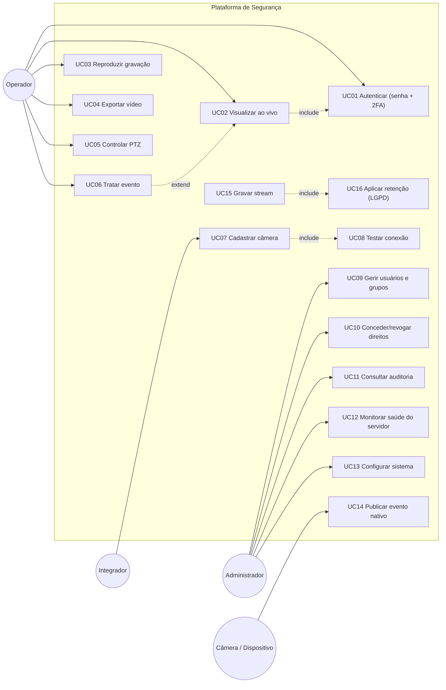
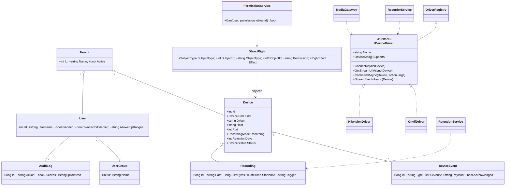
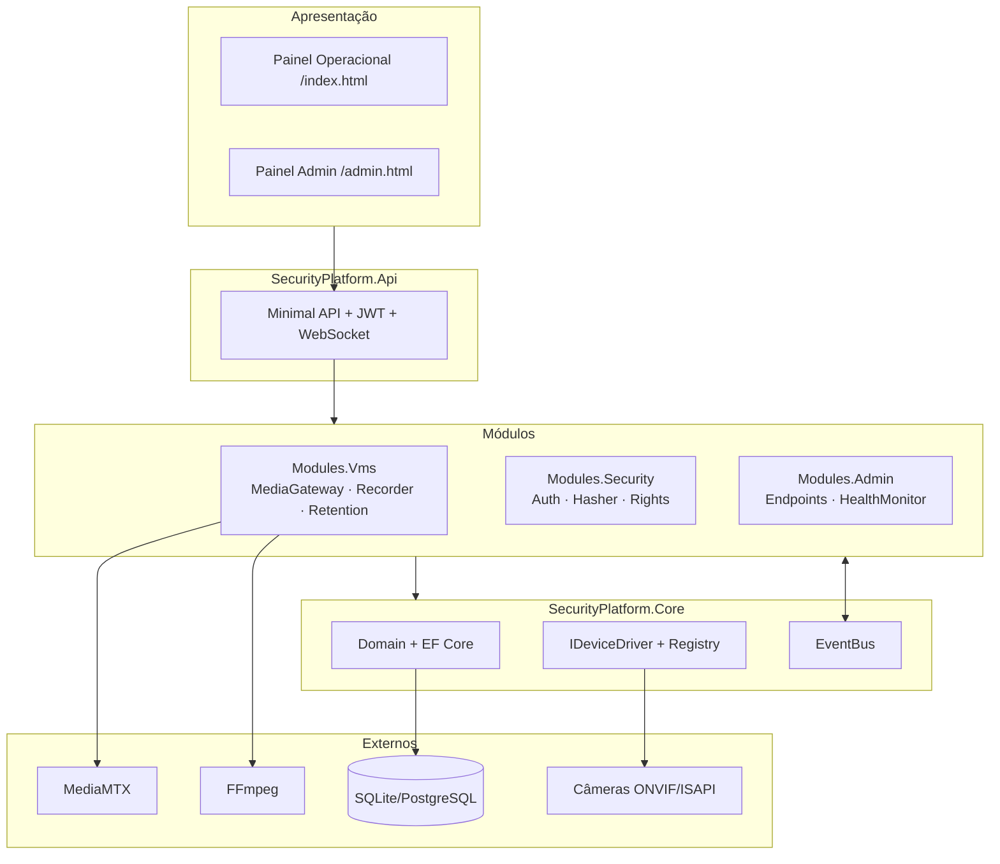
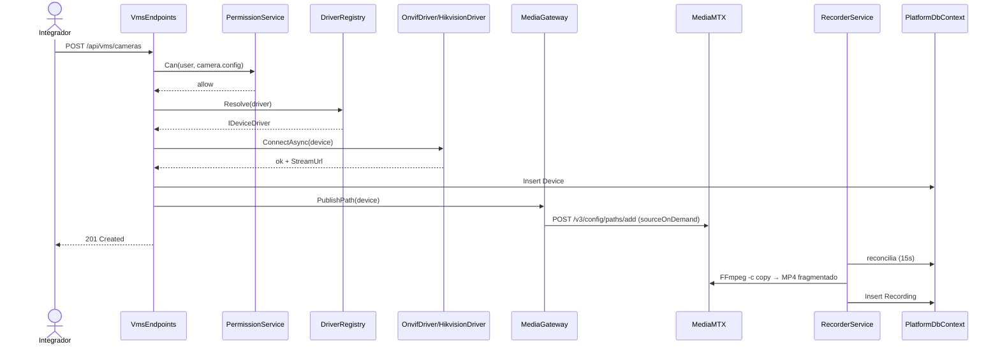
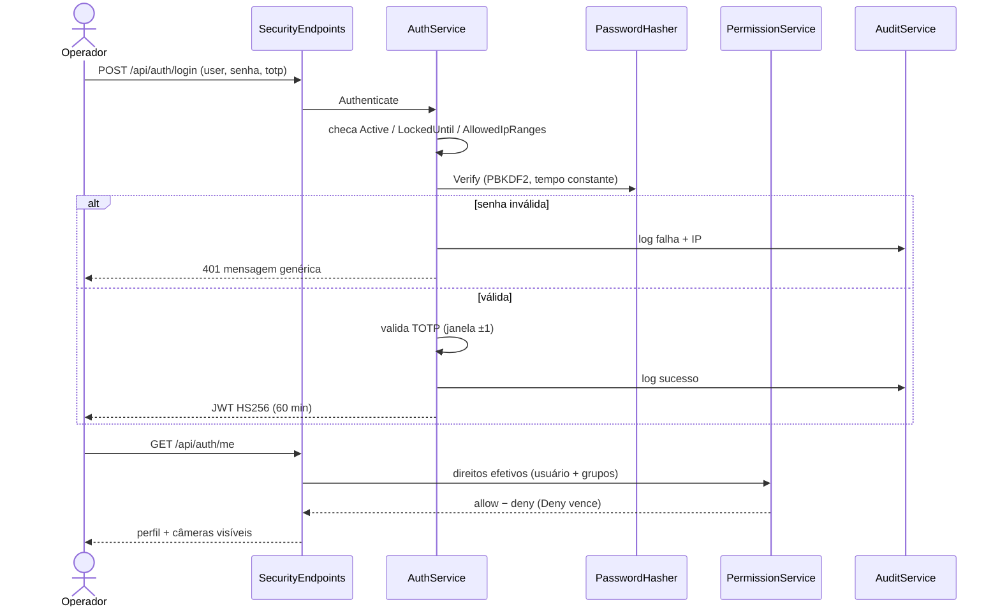
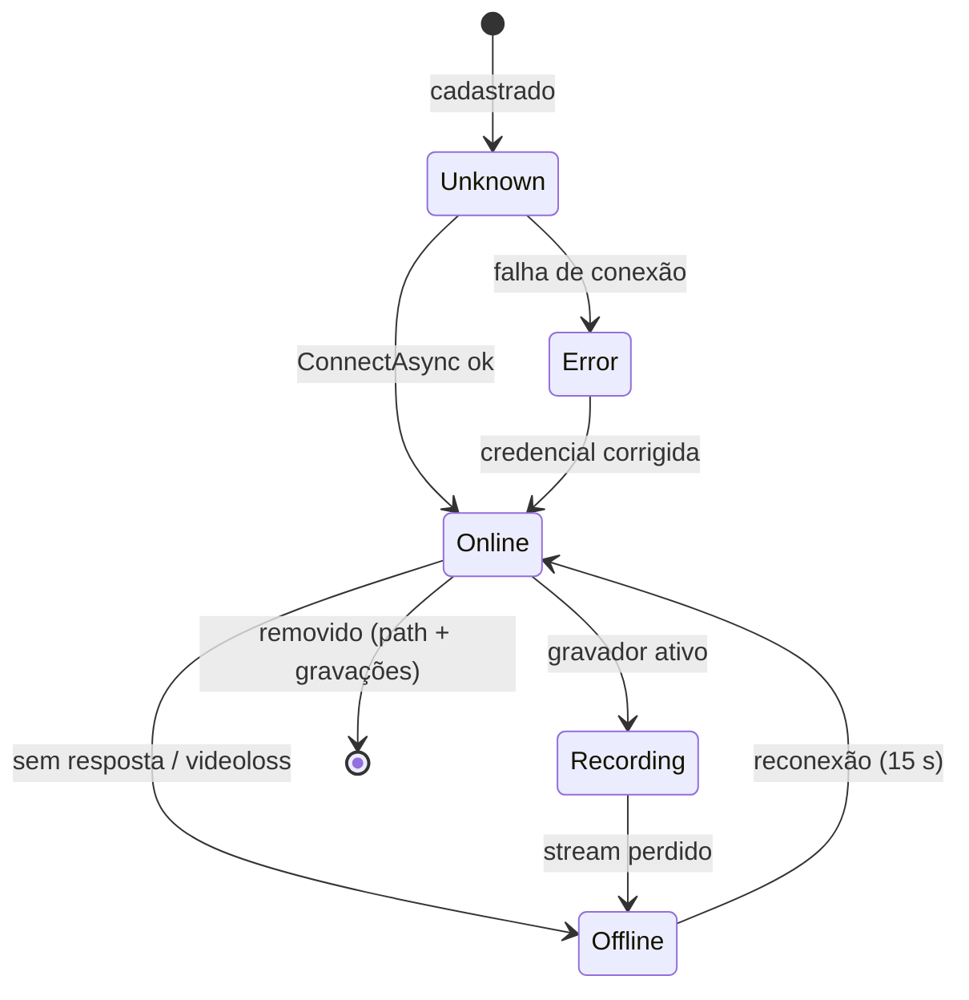
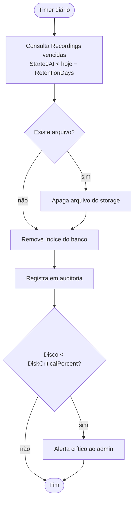
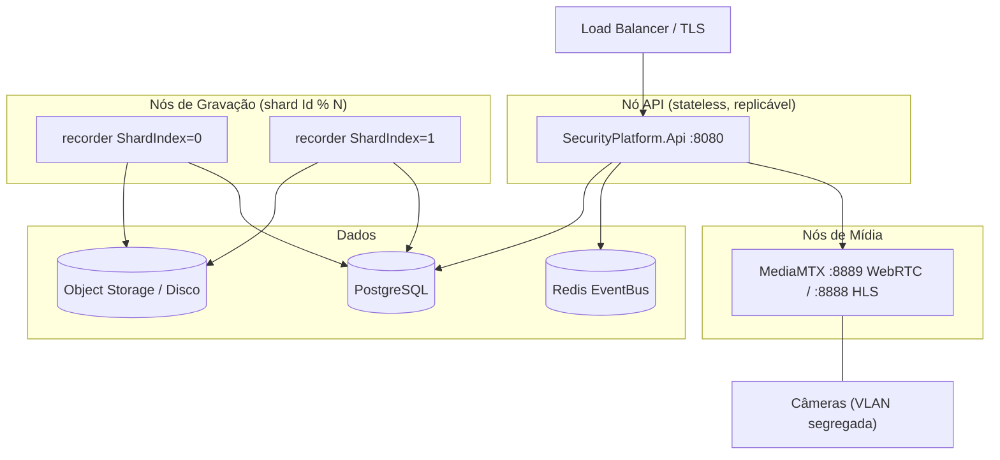
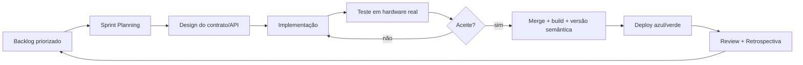

# Documentação de Engenharia — Plataforma Unificada de Segurança Eletrônica

> Complemento do [README.md](../README.md). Versão 1.0 — 2026-07-21.
> Cobre: Requisitos do Cliente · Casos de Uso · Diagramas UML · Modelo de Dados (SGBD) · Metodologia de Desenvolvimento.

---

## 1. Documentação de Requisitos do Cliente

### 1.1 Escopo e stakeholders

| Ator | Interesse |
|------|-----------|
| Integrador / Instalador | Cadastrar hardware multimarca sem retrabalho |
| Operador de Monitoramento | Tratar eventos com vídeo associado, seguir o POP |
| Administrador de Segurança | Usuários, direitos, relatórios, auditoria |
| Gestor de Central (Multi-Tenant) | Saúde da infra e licenças de vários clientes |
| Cliente Final / Síndico | App: abrir portas, ver câmeras, notificações |

### 1.2 Requisitos Funcionais

| ID | Requisito | Prioridade | Status |
|----|-----------|:----------:|:------:|
| RF01 | Cadastrar, editar e remover câmeras com teste de conexão prévio | Must | ✅ |
| RF02 | Exibir vídeo ao vivo no navegador (WebRTC/HLS) sem plugin | Must | ✅ |
| RF03 | Gravar continuamente com segmentação e retenção configurável | Must | ✅ |
| RF04 | Reproduzir gravações por linha do tempo com seek (HTTP Range) | Must | ✅ |
| RF05 | Descartar gravações vencidas automaticamente (LGPD) | Must | ✅ |
| RF06 | Receber eventos nativos da câmera (motion, intrusão, LPR, tamper) | Must | ✅ |
| RF07 | Distribuir eventos ao operador em tempo real (WebSocket) | Must | ✅ |
| RF08 | Autenticar com senha forte, bloqueio por tentativas e 2FA TOTP | Must | ✅ |
| RF09 | Controlar direitos por objeto (allow/deny) para usuário e grupo | Must | ✅ |
| RF10 | Registrar trilha de auditoria imutável com IP de origem | Must | ✅ |
| RF11 | Controlar PTZ (presets, movimento contínuo, snapshot, reboot) | Should | ✅ |
| RF12 | Painel administrativo com árvore por domínio | Should | ✅ |
| RF13 | Agendar janelas de gravação por dia/horário | Should | ✅ |
| RF14 | Executar regras de automação (SE evento → ENTÃO ações) | Should | ✅ Email, PTZ, Bookmark, HTTP |
| RF15 | Notificar contatos por e-mail (SMTP) | Should | ✅ via automação |
| RF16 | Controlar licenciamento por canal/ponto/zona | Should | ✅ bloqueia canal excedente |
| RF17 | Módulo de Controle de Acesso (OSDP/SDK, anti-passback, eclusa) | Could | ⬜ |
| RF18 | Módulo de Alarmes (SIA-DC09 / Contact ID) e mapa sinóptico | Could | ⬜ |
| RF19 | Multi-tenant / GMC e integração LDAP-AD | Could | ⬜ |
| RF20 | Analytics de IA (LPR, facial) em serviço Python | Won't (v1) | ⬜ |

### 1.3 Requisitos Não-Funcionais

| ID | Categoria | Requisito | Métrica de aceite |
|----|-----------|-----------|-------------------|
| RNF01 | Desempenho | Gravação sem transcodificação | CPU ≈ 0% por câmera (`-c copy`) |
| RNF02 | Desempenho | Latência de comando (PTZ/porta) | < 1 s |
| RNF03 | Disponibilidade | Failover automático | RTO ≤ 60 s · RPO ≈ 0 p/ eventos |
| RNF04 | Disponibilidade | SLA por edição | 99,9% Pro · 99,99% Enterprise |
| RNF05 | Resiliência | Gravação sobrevive a queda de energia | MP4 fragmentado, arquivo já reproduzível |
| RNF06 | Resiliência | Auto-recuperação de gravador e de stream | reconciliação a cada 15 s |
| RNF07 | Escalabilidade | Crescer por configuração, sem alterar código | sharding `Id % N`, API stateless |
| RNF08 | Segurança | TLS 1.2+ em trânsito, AES-256 em repouso | — |
| RNF09 | Segurança | PBKDF2-HMAC-SHA256, 210.000 iterações | OWASP 2023 |
| RNF10 | Segurança | Credencial RTSP nunca trafega ao navegador | — |
| RNF11 | Conformidade | Retenção/descarte automático e blur facial | LGPD/GDPR |
| RNF12 | Portabilidade | Mesma imagem no Windows e em contêiner Linux | .NET 8 |
| RNF13 | Interoperabilidade | Novo fabricante = 1 classe + 1 linha de registro | `IDeviceDriver` |
| RNF14 | Observabilidade | Logs centralizados, métricas e auditoria | — |

### 1.4 Regras de Negócio

| ID | Regra |
|----|-------|
| RN01 | **Deny sempre vence Allow** na resolução de direitos |
| RN02 | `ObjectId` nulo vale para todos os objetos daquele tipo |
| RN03 | Administrador ignora a checagem de direitos |
| RN04 | Câmera negada não aparece na listagem e retorna `403` no acesso direto |
| RN05 | Senha inicial e reset exigem troca no primeiro acesso |
| RN06 | 5 tentativas falhas → bloqueio de 15 min (configurável) |
| RN07 | Mensagem de login é genérica — não revela existência do usuário |
| RN08 | Senha em branco na edição mantém a senha atual |
| RN09 | O Core nunca fala com hardware: tudo passa por `IDeviceDriver` |
| RN10 | Evento com `eventState=inactive` é descartado |

### 1.5 Restrições e Premissas

- Rede de câmeras segregada em VLAN; portas RTSP (554) e HTTP do fabricante acessíveis ao servidor.
- FFmpeg no PATH e MediaMTX na raiz do projeto (sem ele, live indisponível — gravação e API seguem).
- SQLite em Windows/dev; PostgreSQL em nuvem (troca apenas da *connection string*).
- IA/Analytics fora do .NET, em serviço Python consumido via API.

---

## 2. Casos de Uso



### UC07 — Cadastrar câmera (fluxo detalhado)

| Campo | Conteúdo |
|-------|----------|
| **Ator** | Integrador / Administrador |
| **Pré-condição** | Autenticado com `camera.config`; licença com canal disponível |
| **Fluxo principal** | 1. Abre *Câmeras* no painel admin → 2. Preenche Geral (nome, driver, IP, porta, credencial) → 3. Aciona **Testar conexão** → 4. Sistema resolve o driver e valida RTSP (mascarado no log) → 5. Salva → 6. Publica o *path* no nó de mídia → 7. Gravador inicia FFmpeg → 8. Câmera aparece no grid |
| **Fluxo alternativo A1** | Teste falha → exibe motivo, não persiste |
| **Fluxo alternativo A2** | Edição com senha em branco → mantém a credencial atual (RN08) |
| **Exceção E1** | Sem `camera.config` → `403` + registro em auditoria |
| **Pós-condição** | `Device` persistido, path ativo no MediaMTX, gravação em curso |

### UC06 — Tratar evento

| Campo | Conteúdo |
|-------|----------|
| **Ator** | Operador |
| **Gatilho** | Evento recebido via WebSocket `/ws/events` |
| **Fluxo principal** | 1. Evento surge na fila priorizado por severidade → 2. Operador assume → 3. Pop-up abre a câmera associada → 4. Segue o POP passo a passo → 5. Registra ação e resolve (`event.ack`) |
| **Exceção** | Sem permissão sobre a câmera → o evento não exibe vídeo |
| **Pós-condição** | `DeviceEvent.Acknowledged = true` + `AuditLog` da ação |

---

## 3. Diagramas UML

### 3.1 Classes — Domínio e Drivers



### 3.2 Componentes



### 3.3 Sequência — Cadastro de câmera e início da gravação



### 3.4 Sequência — Login com 2FA e resolução de direitos



### 3.5 Estados — Ciclo de vida do dispositivo



### 3.6 Atividade — Retenção LGPD



### 3.7 Implantação



---

## 4. Modelo de Dados (SGBD)

**SGBD:** SQLite (Windows/dev) → PostgreSQL (produção/nuvem), via EF Core — troca apenas da *connection string*.
**Persistência poliglota prevista:** relacional (cadastro/config) · time-series (eventos/telemetria) · object storage (arquivos de vídeo — o banco guarda só o índice).

### 4.1 Diagrama Entidade-Relacionamento

```mermaid
erDiagram
    TENANT ||--o{ DEVICE : possui
    TENANT ||--o{ USER : possui
    TENANT ||--o{ USERGROUP : possui
    DEVICE ||--o{ DEVICEEVENT : gera
    DEVICE ||--o{ RECORDING : produz
    DEVICE ||--o{ SCHEDULESLOT : agenda
    DEVICE ||--o{ CAMERAGROUPMEMBER : pertence
    CAMERAGROUP ||--o{ CAMERAGROUPMEMBER : agrupa
    CAMERAGROUP ||--o{ CAMERAGROUP : "árvore (ParentId)"
    USER ||--o{ USERGROUPMEMBER : participa
    USERGROUP ||--o{ USERGROUPMEMBER : contem
    USER ||--o{ AUDITLOG : registra
    USER ||--o{ OBJECTRIGHT : "subject=User"
    USERGROUP ||--o{ OBJECTRIGHT : "subject=Group"
    DEVICE ||--o{ OBJECTRIGHT : "object=camera"
    AUTOMATIONRULE }o--o| DEVICE : "WhenDeviceId (nulo=qualquer)"
    MEDIAPROFILE }o--o{ DEVICE : aplica

    TENANT { int Id PK; string Name; bool Active; datetime CreatedAt }
    DEVICE { int Id PK; int TenantId FK; string Name; enum Kind; string Driver; string Host; int Port; string Username; string Password; string StreamUrl; enum Recording; int RetentionDays; enum Status; datetime LastSeen }
    DEVICEEVENT { bigint Id PK; int TenantId FK; int DeviceId FK; string Type; int Severity; json Payload; bool Acknowledged; datetime CreatedAt }
    RECORDING { bigint Id PK; int TenantId FK; int DeviceId FK; string Path; bigint SizeBytes; datetime StartedAt; datetime EndedAt; string Trigger }
    USER { int Id PK; int TenantId FK; string Username UK; string PasswordHash; bool IsAdmin; bool Active; bool MustChangePassword; bool TwoFactorEnabled; string TotpSecret; string AllowedIpRanges; int FailedAttempts; datetime LockedUntil }
    USERGROUP { int Id PK; int TenantId FK; string Name; string Description }
    USERGROUPMEMBER { int Id PK; int UserId FK; int GroupId FK }
    OBJECTRIGHT { int Id PK; int TenantId FK; enum SubjectType; int SubjectId; string ObjectType; int ObjectId "nullable"; string Permission; enum Effect }
    AUDITLOG { bigint Id PK; int TenantId FK; int UserId FK; string Username; string Action; string ObjectType; string ObjectId; bool Success; string Detail; string IpAddress; datetime CreatedAt }
    CAMERAGROUP { int Id PK; int TenantId FK; string Name; int ParentId FK "nullable" }
    CAMERAGROUPMEMBER { int Id PK; int GroupId FK; int DeviceId FK }
    MEDIAPROFILE { int Id PK; int TenantId FK; string Name; string Codec; int Width; int Height; int Fps; int BitrateKbps; int Channel; bool IsDefault }
    SCHEDULESLOT { int Id PK; int TenantId FK; int DeviceId FK; enum Kind; int Day "nullable"; time Start; time End; bool Enabled }
    AUTOMATIONRULE { int Id PK; int TenantId FK; string Name; string WhenEventType; int WhenDeviceId "nullable"; int MinSeverity; json Actions; bool Enabled }
    CONTACT { int Id PK; int TenantId FK; string Name; string Email; string Phone; bool Active }
    LICENSE { int Id PK; enum Edition; string Key; string CustomerName; int VideoChannels; int AccessPoints; int AlarmZones; bool Failover; bool MultiTenant; datetime ExpiresAt }
    SYSTEMSETTINGS { int Id PK; string ServerName; string TimeZone; string StorageRoot; int DefaultRetentionDays; int SegmentSeconds; bool EncryptRecordings; int DiskWarningPercent; int DiskCriticalPercent; string SmtpHost; int AuditRetentionDays }
    IPFILTER { int Id PK; enum Mode; string Address "IP ou CIDR"; bool Enabled }
```

### 4.2 Índices e decisões físicas

| Tabela | Índice recomendado | Motivo |
|--------|--------------------|--------|
| `DeviceEvent` | `(TenantId, DeviceId, CreatedAt DESC)` | Fila do operador e histórico |
| `DeviceEvent` | `(Acknowledged, Severity)` | Filtro de eventos pendentes |
| `Recording` | `(DeviceId, StartedAt)` | Playback por faixa e varredura de retenção |
| `AuditLog` | `(TenantId, CreatedAt DESC)`, `(Username)` | Consulta de trilha |
| `ObjectRight` | `(SubjectType, SubjectId, ObjectType)` | Resolução de direitos por requisição |
| `User` | `UNIQUE (TenantId, Username)` | Identidade |
| `Device` | `(TenantId, Status)` | Painel de saúde |

**Decisões:**
- `TenantId` em toda tabela de negócio — habilita multi-tenant sem redesenho.
- Vídeo **nunca** no banco: só o `Path` e metadados; o binário fica no storage.
- `Payload` e `Actions` em JSON — evita migração a cada novo tipo de evento/ação.
- Enums serializados como **texto** no JSON da API: reordenar membros não quebra o contrato.
- Particionamento de `DeviceEvent` por mês no PostgreSQL quando o volume crescer.
- Produção: substituir `EnsureCreated()` por **migrations EF versionadas** (pendência de hardening).

---

## 5. Metodologia de Desenvolvimento

### 5.1 Abordagem: Scrum + XP com entrega incremental por módulo

Justificativa: o escopo é grande e o hardware de campo só se revela na integração real — cada fabricante traz surpresa. Iterações curtas com *release* funcional por módulo reduzem o risco de integração, que é o maior do projeto.

| Prática | Aplicação |
|---------|-----------|
| Sprints | 2 semanas, com incremento executável ao fim de cada uma |
| Backlog | Roadmap de 12 fases (README §9.9) como épicos; RF01–RF20 como itens |
| Definition of Ready | Requisito com critério de aceite + hardware de teste disponível |
| Definition of Done | Código + teste executado em hardware real + README atualizado + auditoria cobrindo a ação |
| Arquitetura | Modular monolítica evoluindo para microsserviços; *bounded contexts* já separados por projeto |
| Design | *Ports & Adapters*: `IDeviceDriver` isola o hardware do domínio |
| Integração contínua | Build + testes + versionamento semântico; deploy azul/verde |
| Refatoração | Contínua, apoiada no contrato de driver (troca de fabricante não toca o core) |
| Documentação | README como fonte única de verdade, com Histórico de Revisões versionado |

### 5.2 Ciclo por incremento



### 5.3 Estratégia de testes

| Nível | Alvo | Como |
|-------|------|------|
| Unitário | Hasher, resolução de direitos, retenção, TOTP | xUnit |
| Integração | Endpoints com banco em memória/SQLite temporário | WebApplicationFactory |
| Contrato de driver | Suíte comum aplicada a todo `IDeviceDriver` | mesma bateria por fabricante |
| Sistema | Câmera física: cadastro → live → gravação → playback | manual roteirizado |
| Segurança | Matriz de 12 cenários já validada (README §10.8) | execução real |
| Carga | N streams simultâneos por nó, IOPS de gravação | antes de cada release |

### 5.4 Controle de versão e releases

- **Git flow simplificado:** `main` estável · `feature/*` por item de backlog · tag por release.
- **SemVer:** MAJOR quebra de contrato de API · MINOR novo módulo · PATCH correção.
- **Rastreabilidade:** cada release atualiza o *Histórico de Revisões* do README (padrão já em uso, v0.1.0 → v1.3.1).

### 5.5 Riscos e mitigação

| Risco | Impacto | Mitigação |
|-------|:-------:|-----------|
| SDK proprietário sem documentação | Alto | ONVIF como fallback garantido; driver nativo incremental |
| Perda de gravação por falha de energia | Alto | MP4 fragmentado + edge recording (Profile G) |
| Vazamento de credencial de câmera | Alto | RTSP nunca enviado ao navegador; segredos em cofre/env |
| Volume de eventos degradando o banco | Médio | JSON no payload, índices, particionamento, retenção por tipo |
| Licenciamento contornável | Médio | Passar de "conta e alerta" para bloqueio efetivo (pendência) |
| Dependência de MediaMTX/FFmpeg | Médio | Isolados atrás de `MediaGateway`/`RecorderService` — substituíveis |
